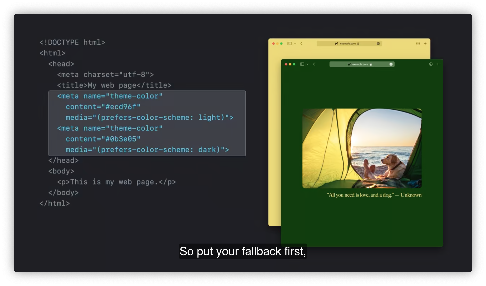
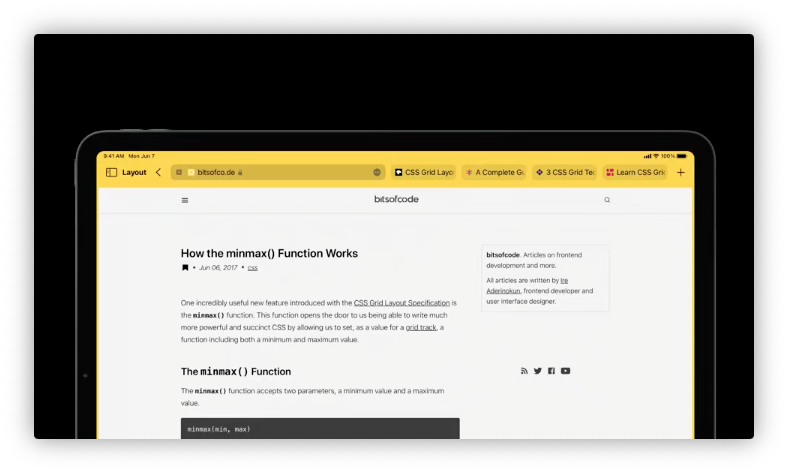

# Design for Safari 15

Safariはデザインが一新された。

TBD: サブスクリプションがない...

セッション構成は以下のようだ。

## New Safari design

### ページ全体の色合い

以下のmetaタグでSafariツールバーを色付けできる。

```html
<meta name="theme-color" content="#ecd96f">
```



ダークモードも対応。

### タブバー



faviconも高解像を使うとか。

タブバーは `<title>` テキストをトランケートするので、タブ表示で強調したい文字列を先に書いたほうが良い。

### タブグループ

TBD

## New features and the web

TBD

## What's new in CSS

TBD

## From controls

TBD
