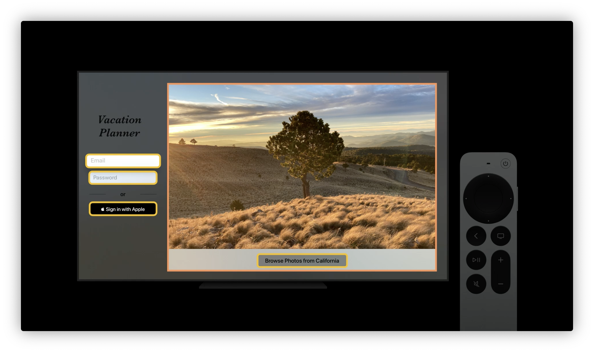

# Direct and reflect focus in SwiftUI

<https://developer.apple.com/wwdc21/10023>

> SwiftUIでアプリ内のフォーカスを移動させたり、プログラム的にキーボードを解除したり、小さなビューから大きなナビゲーションターゲットを構築する方法。これらのAPIは、あなたのアプリのインターフェイスを簡素化し、人々が必要なものを見つけるために、より強力にするのに役立ちます。

とのこと。

ファシリテータはApple TVチームのSwift UIエンジニアの方。

## フォーカスの移動と判定

### FocusState

新しい`FocusState` プロパティ。現在のフォーカスの位置に応じて変化する，特殊なタイプの状態。`FocusState`を使って、フォーカスされているフィールドの識別子を保持することができる。

```swift
enum Field: Hashable {
  case email
  case password
}

struct ContentView: View {
  @FocusState private var focusedField: Field?
}
```

`FocusState`の値は任意。使用する型は、`Hashable`でオプショナルでなければならず、画面の無関係な部分にフォーカスがある場合には`nil`になる。

### `TextField`と`SecureField`の`focuses`修飾子

新機能であるこの修飾子は、フォーカスの配置と`focusedField`プロパティの値の間に関連を作成する。
フォーカスの変化に反応するだけではなく、`FocusState`プロパティを更新することで、プログラム的にフォーカスを移動させることができる。

```swift
enum Field: Hashable {
  case email
  case password
}

struct ContentView: View {
  @FocusState private var focusedField: Field?

  var body: some View {
    ZStack {
      TextField("Email", text: $email)
        .focused($focusedField, equals: .email)
      SecureField("Password", text: $password)
        .focused($focusedField, equals: .password)
    }
  }
}
```

例えば`、focusedField`の値をプログラムで`.password`に設定すると、SwiftUIは`SecureField`が設定した新しい値に関連付けられていることを認識し、フォーカスは自動的にパスワードフィールドに移動する。

## 値のバリデーションとUI

- 電子メールが期待した形式でない場合、focusedFieldをemailに設定する。
    - これにより、Eメールのテキストフィールドにフォーカスが戻る。
- Eメールが無効だった場合は、Eメールフィールドをボーダーで強調。
    - このボーダーは、フォーカスがEメールフィールドにある間だけ表示される。
- すべてのフォームデータが有効な場合は、キーボードを閉じるだけ。


以上の実装は以下の通り。

```swift
enum Field: Hashable {
  case email
  case password
}

struct ContentView: View {
  @FocusState private var focusedField: Field?

  var body: some View {
    ZStack {
      TextField("Email", text: $email)
        .focused($focusedField, equals: .email)
        .border(Color.red,
                width: (focusedField == .email && !isEmailValid) ? 2 : 0)
      SecureField("Password", text: $password)
        .focused($focusedField, equals: .password)
    }
    .onSubmit {
      if !isEmailValid {
        focusedField = .email
      } else {
        focusedField = nil
        // プログレスインジケータを表示してログインする
      }
    }
  }
}
```

これらは、iOS、tvOS、watchOS、macOS上のあらゆるフォーカス可能なビューのフォーカスをプログラムで制御するために使用できる。

## フォーカスベースのナビゲーション

`FocusSections` APIについて。



右半分の枠は、Eメールとパスワードフィールドからブラウズボタンにフォーカスを移動させるために作成する。

ここでのフォーカス移動はTABキーやSiriリモコンのスワイプ動作を指す。

フォーカス移動は隣接するフォーカス可能ビュー同士に限られるので、この枠を用意しないと、ブラウズボタンにフォーカスできない。

そして、`focusSections`修飾子を付与する。

```swift
HStack {
  VStack {
    TextField("Email", text: $email)
    TextField("Password", text: $password)
    SignInWithAppleButton(...)
  }
  .onSubmit { ... }
  .focusSections() // 💡

  VStack {
    Image(photoName)
    BrowsePhotosButton()
  }
  .focusSections() // 💡
}
```

`focusSection`修飾子が任意のビューに追加されると、そのビューのフレームは、フォーカス可能なサブビューを含む場合、フォーカスを受け入れることができるようになる。

また、ボタンを左にスワイプしたときに、ログインフィールドにフォーカスを戻したい場合は、最初のVStackにも`focusSection`修飾子を追加する。これで、Siriリモートで左右スワイプすると、ログインフィールドとBrowseボタン間でフォーカスを移動するようになる。


## まとめ

- フォーカスはプラットフォームごとに考えろ
- SwiftUIは優れたデフォルト動作を持っている
- 強力なフォーカスAPIによるレバレッジ効果
