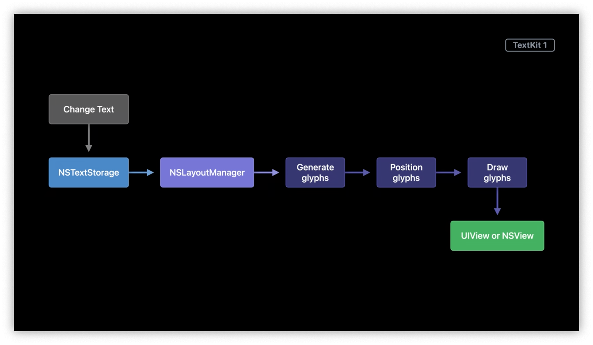
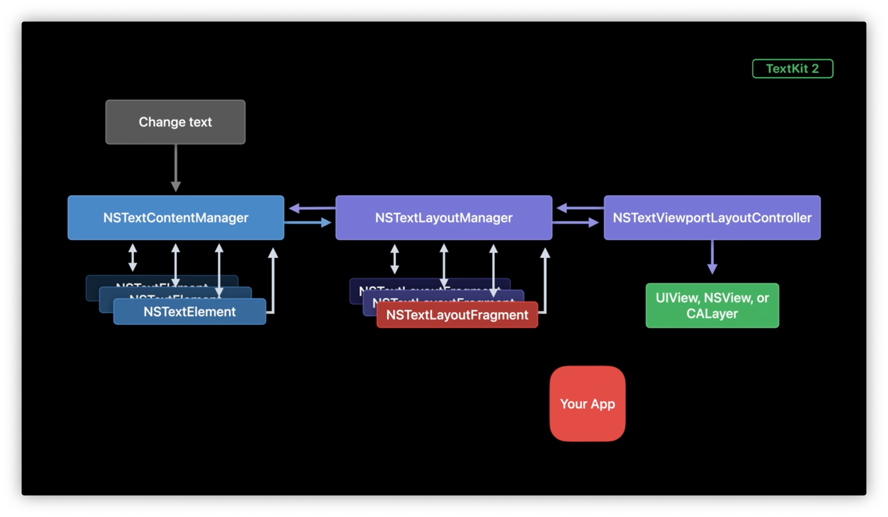

# Meet TextKit 2

<https://developer.apple.com/wwdc21/10061>

TextKit 2は、Appleの次世代テキストエンジンで、正確性、安全性、パフォーマンスの向上のために再設計されています。

TextKit 2を使うと、海外のユーザーにも優れたテキスト体験を提供したり、テキストコンテンツとビジュアルコンテンツを組み合わせてより多様なレイアウトを作成したり、スムーズなスクロールパフォーマンスを実現したりすることができます。

本セミナーでは、最新のAPIを紹介するとともに、実用的な例を挙げ、アプリケーションを近代化するためのガイダンスを提供します。

Big Surでは、OS全体のテキストコンポーネントの多くをアップデートし、舞台裏でTextKit 2を使うようになっている。

TextKit 2とTextKit 1は共存している。

TextKit 2は、Foundation、Quartz、Core Textの上に構築されている。UIKitとAppKitのテキストコントロールは、TextKit 2の上に構築されている。

## Design Principles

TextKit 2の上流の設計原則は以下の通り。

- 正しさ
- 安全性
- パフォーマンス

です。TextKit 2はバランスのとれたアプローチを採用している。この3つの原則はどれも重要なので、説明する順番に優先順位はない。

これらの上流設計原則は、それぞれシステムの具体的な設計変更に反映されている。

- 正しさのために、TextKit 2はグリフ処理を抽象化する。
- 安全性のために、TextKit 2は値のセマンティクスを重視する。
- パフォーマンスのために、TextKit 2はビューポートベースのレイアウトとレンダリングを採用する。

### グリフ処理の抽象化

TextKit 2では、グリフを管理する必要はまったくありません。代わりに、高レベルのオブジェクトを使用して、テキストのレイアウトやインタラクションを制御します。

#### インドのカナンダ語を用いた解説は最高

> 文字インデックス4に分割母音があるため、2つのグリフに分割されます。
> そして左のグリフは、文字1と文字2を表すグリフの間で並び替えられた後、2の合字が適用されます。
> インデックス3の文字を表すグリフも連結形に置換されます。
> 最終的には、分割母音のグリフのひとつ下に描かれています。

何言ってるか理解できん😇。

#### 選択

テキストの選択を表す`NSTextSelection`がある(TextKit 1にもあったはず)。

それを生成する（テキスト選択する）`NSTextSelectionNavigation` がTextKit 2で追加された。

```swift
class NSTextSelectionNavigation {
  // ある座標で発生したイベントからテキストセレクションを入手する
  func textSlections(interactingAt point: NSPoint,
                       containerLocation: NSTextLocation,
                                 anchors: [NSTextSelection],
                               modifiers: NSTextSelectionNavigation.Modifier,
                               selecting: Bool,
                                  bounds: CGRect) -> [NSTextSelection]

  // 語、段落、行、などによってテキストセレクションを拡張する
  func textSelection(for selectionGranularity: NSTextSelection.Granularity,
                      enclosing textSelection: NSTextSelection) -> NSTextSelection
}
```

位置の指定が `NSTextLocation` オブジェクトになっており、これは整数値ではない。

- `protocol NSTextLocation`

  文書内の位置を表現する。

- `class NSTextRange`

  開始と終了位置の間を表現する。

### 値のセマンティクス

値のセマンティクスとは値型ではない。
イミュータブルなクラスは値のセマンティクスを持っている。よって値型のように振る舞う。





- テキストストレージの更新は、コンテンツマネージャーと呼ばれる新しいオブジェクトを介して行われる。
- コンテンツマネージャーは、テキストを要素に分割し、それらを管理する。
- レイアウトを行なう際には、テキストレイアウトマネージャーがコンテンツマネージャーに要素を問い合わせる。
- テキストレイアウトマネージャーは、要素をテキストコンテナにレイアウトし、レイアウトや位置情報を含むレイアウトフラグメントを生成します。
- 表示の際には、レイアウトフラグメントはViewportLayoutControllerに渡され、ViewportLayoutControllerはこれらのフラグメントの位置とレイアウトを、ビューやレイヤーなどのレンダリングサーフェスで調整する。

見ての通り、このプロセスには多くの新しいオブジェクトが含まれている。ここで、値セマンティクスの重要性が強調される。

変更を加えるには、必要な変更を加えた新しい値オブジェクトを作成し、システムに戻す。システムは、あなたが置き換えたオブジェクトの値をレイアウトや表示に使用する。

#### ストレージオブジェクト

`NSTextElement` 抽象クラス。

これは内容の部分を表現し、かつ、文書中のどこにあるのかを示す範囲を持っています。そして、要素は値セマンティクスです。範囲を含むプロパティはイミュータブルです。

文書を文字の羅列ではなく、要素の連なりとしてモデル化することで、より大きな力を得ることができます。ある要素がどのようなコンテンツを表しているのか、それがテキストの段落なのか、添付ファイルなのか、あるいはその他のカスタムタイプなのかを簡単に見分けることができるようになる。そして、その種類に応じて、要素のレイアウトを決定することができる。

#### コンテントマネージャ

`NSTextContentManager` 抽象クラス。

テキスト内容から要素を提供する。コンテントマネージャーはテキスト内容から要素を生成する方法を知っており、文書全体の中でそれらの要素の範囲を追跡します。

バッキングストアのラッパーでもある。

`NSTextElement`と`NSTextContentManager`はどちらも抽象型なので、カスタムの文書モデルやカスタムのバッキングストアが欲しい場合は、継承すれば良い。

#### パラグラフとコンテントストレージ

- `NSTextContentStorage` クラス
    - デフォルトのコンテントマネージャ
    - `NSTextStorage`をバッキングストアとして使用する
- `NSTextParagraph` クラス
    - デフォルトの要素型
    - 単一のパラグラフを`NSAttributedString`として表現する

#### コンテントストレージの変更


```swift
class NSTextContentManager {
  func performEditingTransaction(_ transaction: () -> Void)
}
```

基礎となるテキスト・ストレージに変更を加えるときは、その更新をこの`performEditingTransaction`メソッドでラップする必要がある。これにより、TextKit 2システムの他の部分に変更が通知されます。

### テキストレイアウトマネージャ

`NSTextLayoutManager` クラス。

TextKit 1の古い`NSLayoutManager`に似ているが、1つ大きな違いがありグリフを扱わない。代わりに以下を行なう。

- テキストレイアウト処理を制御する
- 要素集からレイアウトフラグメント集を生成する

`NSTextLayoutFragment` クラスは、1つ以上のテキスト要素のレイアウト情報を持つ。レイアウトフラグメントは、要素と同様に値のセマンティクスを使用し、そのプロパティはイミュータブルである。

レイアウトフラグメントは、`textLineFragments`、`layoutFragmentFrame`、および`renderingSurfaceBounds`の3つのプロパティを通じてレイアウト情報を伝達する。

```swift
class NSTextLayoutFragment {
  var textLineFragments: [NSTextLineFragment] { get }
  var layoutFragmentFrame: CGRect { get }
  var renderingSurfaceBounds: CGRect { get }
}
```

- `NSTextLineFragment`

  ラインフラグメントには、レイアウトフラグメント内のテキストの各行の測定情報が含まれる。この情報は、特定の行の幾何学的情報を取得したり、レイアウトフラグメント内の行数をカウントするのに使用できる。

- `layoutFragmentFrame`

  レイアウトフラグメント内のテキストがテキストコンテナエリア内でどのようにレイアウトされるかを記述する。TextKit 2では、テキストのレイアウトは基本的に、コンテナ内の`layoutFragmentFrame`を積み重ねることになる。このフレームはタイルのようなものである。システムは、テキストコンテナ領域をタイルに分割し、各レイアウトフラグメントを1つのタイルとして取り扱う。

- `renderingSurfaceBounds`

  テキストの描画に必要な領域を記述する。これは、ビュー座標空間におけるテキストのサイズを取得するために使用する矩形である。`layoutFragmentFrame`ではテキストがフラグメントフレームの端をオーバーシュートすることがありますが、`renderingSurfaceBounds`にはありません。

  例えば、Zapfinoのように、タイポグラフィの境界から非常に大きくはみ出したグリフを持つフォントもあります。この場合、`renderingSurfaceBounds`は`layoutFragmentFrame`よりもはるかに大きくなる。

### レイアウトフラグメントのカスタマイズ

先ほどのフロー図に戻ると、レイアウトプロセスにフックして、変更したい情報を持つ`NSTextLayoutFragment`の新しいインスタンスを作成する必要がある。

そして、`NSTextLayoutManager`のデリゲートメソッドを使って、レイアウトプロセスにフックする。

```swift
protocol NSTextLayoutManagerDelegate {
  optional func textLayoutManager(_ textLayoutManager: NSTextLayoutManager,
                       textLayoutFragmentFor location: NSTextLocation,
                                       in textElement: NSTextElement) -> NSTextLayoutFragment?
}
```

このメソッドは、テキストレイアウトマネージャーが要素からレイアウトフラグメントを生成しているレイアウト処理中に呼び出される。ここで、要素に対して独自のレイアウトフラグメントを作成することができる。

### ビューポートベースのレイアウトとレンダリング

- 連続レイアウト: 常に最初からレイアウトする。テキストが長いと遅い。
- 非連続レイアウト: 見えている部分(に必要な領域)だけをレイアウトする。

TextKit 2のレイアウトは常に非連続である。TextKit 1では、非連続レイアウトはオプションだった。これは、NSLayoutManagerの真偽値プロパティを使って有効にできた。このAPIはシンプル。シンプルであるがゆえに、レイアウト情報を要求した時点でのレイアウトの状態に関する情報を表現できなかった。

```swift
class NSLayoutManager {
  var allowsNonContiguousLayout: Bool { get }
}
```

非連続レイアウトは、ドキュメントの他の部分がレイアウトされるとあとで変更される可能性のある見積もりに依存する。TextKit 1では、非連続レイアウトのオン/オフのみが可能。

文書のどの部分をレイアウトするかを制御する機能はなく、レイアウトが終了してレイアウトの見積もりが実際の値に更新されたことを知る方法はなかった。

TextKit 2のAPIは、よりリッチで表現力がある。TextKit 2は、可視コンテンツ領域の要素に対して一貫したレイアウト情報を提供し、その可視領域のレイアウトが更新されると通知します。

この領域をビューポートと呼ぐ。ビューポートを調整したり再配置したりして管理し、ビューポートレイアウトの前、中、あとでコールバックする。

最適なパフォーマンスを得るためには、コードはビューポート領域内のレイアウト情報を扱うことに集中する必要がある。ビューポートの外側にある要素のレイアウト情報を要求することは、可能な限り避ける。

ビューポート外の要素のレイアウト情報は、それらの要素に対応するテキスト範囲のレイアウトを確保するように明示的に要求しない限り、正確ではない。特に大規模なドキュメントの場合、この呼び出しにはコストがかかる。

先ほどのフロー図を見てみると、ビューポートの管理に役立つ新しいコントローラクラス `NSTextViewportLayoutController` がある。

`NSTextViewportLayoutController`は、ビューポートのレイアウト情報を管理する。そして、テキストレイアウトマネージャーと通信し、ビューポート領域内の要素のレイアウトフラグメントを取得する。ビューポートレイアウトコントローラにアクセスするには、テキストレイアウトマネージャーのプロパティを使用する。

ビューポートレイアウトコントローラは、ビューポートレイアウト処理中にそのデリゲートで3つの重要なメソッドを呼び出します。

```swift
protocol NSTextViewportLayoutControllerDelegate {

  func textViewportLayoutControllerWillLayout(_ controller: NSTextViewportLayoutController)

  func textViewportLayoutController(_ controller: NSTextViewportLayoutController,
          configureRenderingSurfaceFor textLayoutFragment: NSTextLayoutFragment)

  func textViewportLayoutControllerDidLayout(_ controller: NSTextViewportLayoutController)

}
```

まず、ビューポートレイアウトコントローラは、ビューポートに要素をレイアウトする前に、`willLayout`メソッドを呼び出します。ここでは、ビューやレイヤーのコンテンツをクリアにするなど、レイアウトの準備作業を行います。

次に、ビューポートレイアウトコントローラは、ビューポートに表示されているすべてのレイアウトフラグメントに対して、`configureRenderingSurface`メソッドを呼び出します。ここでは、各フラグメントのビューやレイヤーのジオメトリを更新します。

最後に、ビューポートレイアウトコントローラは、ビューポートに表示されているすべてのレイアウトフラグメントのレイアウトを完了した後、`didLayout`メソッドを呼び出します。また、最後の要素が画面に完全に表示されるようにビューポートを調整したい場合など、ビューポートレイアウトが終了した後に必要な更新を行なうのもここです。

## Demo

### サンプルコードのトピック

- クリック、ドラッグ、タッチをテキストセレクションに変換する
- テキストセレクションのレンダリング
- レイアウトフラグメントの幾何学情報を取得する
- 文書の高さを概算する

## Modernization

TextKit 1は内蔵のテキストコントロールに不可欠な要素であるため、それらを使用しているアプリケーションの互換性を維持する必要がある。そのため、iOS 15とmacOS 12では、一部のコントロールだけが自動的にTextKit 2を使用している。また、一部のコントロールでは、これらのOSバージョンでTextKit 2を使用するために特別な手順を踏む必要がある。

`NSTextView`でTextKit 2を使用したい場合は、作成時にプログラムでオプトインする必要があります。

```swift
let textLayoutManager = NSTextLayoutManager()
let textContainer = NSTextContainer(size: NSSize(width: viewWidth, height: 0))

textLayoutManager.textContainer = textContainer

let textView = NSTextView(frame: viewFrame, textContainer: textContainer)
```

まず、テキストレイアウトマネージャを作成します。次に、テキストコンテナを作成します。次に、`NSTextLayoutManager`の`textContainer`プロパティを使用して、テキストコンテナをテキストレイアウトマネージャに関連付けます。最後に、テキスト・コンテナの指定されたイニシャライザを使用して、`NSTextView`を作成します。これで、TextKit 2を使ったテキストビューが完成しました。

`NSTextView`に特別な互換モードを追加し、必要に応じてTextKit 1に切り替えるようになっている。テキストビューは、このモードを使用する必要があるかどうかを自動的に検出して、`NSTextLayoutManager`を`NSLayoutManager`に置き換えることができる。最適なパフォーマンスを得るために、その時点からテキストビューは互換モードのままになる。

TextKit 2 を選択した場合でも、テキストビューやテキストコンテナの`layoutManager`プロパティを明示的に呼び出すと、テキストビューは自動的に TextKit 1 に切り替わりる。また、テキストビューは、まだサポートされていないテキストコンテンツに遭遇した場合や、TextKit 1を必要とするその他の条件を検出した場合にも自動的に切り替わります。

これはフィールドエディタでも起こりえる。`NSTextField`のフィールドエディタは、デフォルトでTextKit 2を使用する。しかし、テキストフィールドのサブクラスがフィールドエディタのレイアウトマネージャからレイアウト情報を要求すると、フィールドエディタはそのウィンドウ内のすべてのテキストフィールドをTextKit 1に切り替える。

システムは、テキストビューがTextKit 1に切り替わる前と後に通知する。これらの通知を監視することで、この情報を受け取ることができる。
