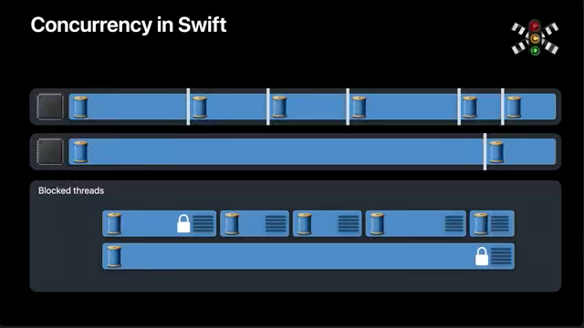
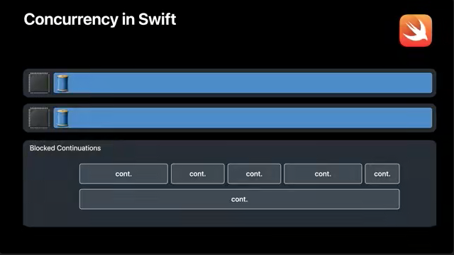
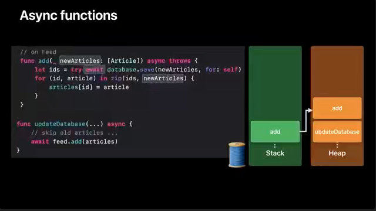
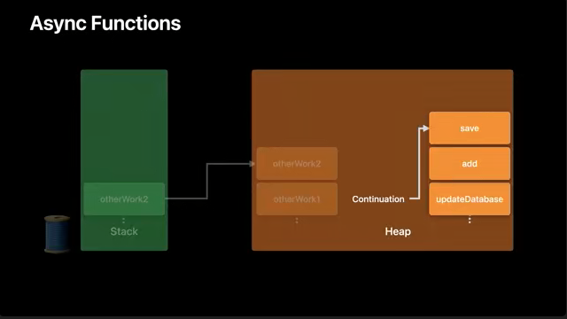
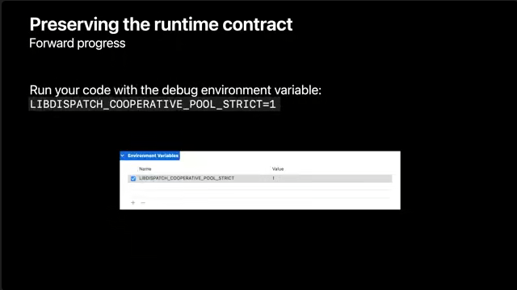

# Swift concurrency: Behind the scenes

Swift並行性の詳細。

- SwiftのタスクがGCDとどのように違うのか
- 新しい協調スレッドモデルがどのように機能するのか
- アプリの最高のパフォーマンスを確保する方法

次のセッションを予習しておくと良い。

- [Meet async/await in Swift](https://developer.apple.com/videos/play/wwdc2021/10132/)
- [Explore structured concurrency in Swift](https://developer.apple.com/videos/play/wwdc2021/10134)
- [Protect mutable state with Swift actors](https://developer.apple.com/videos/play/wwdc2021/10133)

- 💡Darwin Runtimeチームの人が語るのね。
- 💡お題はニュースフィードリーダーアプリです。

## Swift並行性の背後にあるスレッドモデルとGrand Central Dispatchとの対比

Apple Watchのような2コアのデバイスでは、GCDはまず2つのスレッドを立ち上げフィードの更新結果を処理する。

このスレッドがデータベース・キューへのアクセスをブロックすると、ネットワーク・キューでの処理を続けるためにさらにスレッドが生成されます。このときCPUは、ネットワーキングの結果を処理する異なるスレッドへコンテキストスイッチする必要がある。つまり、アプリケーションでは非常に多くのスレッドが必要になる可能性がある。

```swift
// GCDベースの実装

func deserializeArticles(from data: Data) throws -> [Article] { /* ... */ }

func updateDatabase(with articles: [Article], for feed: Feed) { /* ... */ }

let urlSession = URLSession(configuration: .default, delegate: self, delegateQueue: concurrentQueue)

for feed in feedsToUpdate {
  let dataTask = urlSession.dataTask(with: feed.url) { data, response, error in
    // ...
    guard let data = data else { return }
    do {
      let articles = try deserializeArticles(from: data)
      databaseQueue.sync {
        updateDatabase(with: articles, for: feed)
      }
    } catch { /* ... */ }
  }
  dataTask.resume()
}
```

ユーザーが更新しなければならないフィードが100個あるとすると、ネットワークリクエストが完了した時点で、それらの`URLSessionDataTask`のそれぞれが同時実行キューに完了ブロックを持つ。

GCDは、それぞれのコールバックがデータベース・キューでブロックされると、新たなスレッドを立ち上げ、結果としてアプリケーションは多くのスレッドを持つことになる。

アプリケーションに多くのスレッドがあるということは、CPUコアの数よりも多くのスレッドをシステムにオーバーコミットしていることを意味する。

例えば、6つのCPUコアを持つiPhoneを考えてみる。アプリケーションで処理しなければならないフィードの更新が100件あったとすると、コア数の16倍(6 × 16 = 96)ものスレッドをオーバーコミットしたことになる。

これがスレッド爆発と呼ばれる現象である。

以前のWWDCでの講演では、アプリケーションがデッドロックに陥る可能性など、この現象に伴うリスクについて詳しく説明しました。

また、スレッド爆発には、すぐにはわからないメモリやスケジューリングのオーバーヘッドが伴うので、これについても詳しく見ていく。

- 💡過剰な並行性
    - CPUコアよりも多いスレッドをシステムにオーバーコミットする
    - スレッド爆発
    - 性能コスト
        - メモリオーバーヘッド
        - スケジューリングオーバーヘッド

このアプリケーションは、ブロックされた各スレッドは貴重なメモリとリソースを保持しながら再実行を待っている。ブロックされた各スレッドには、スレッドを追跡するためのスタックと関連するカーネルデータ構造がある。これらのスレッドの中には、実行中の他のスレッドが必要とする可能性のあるロックを保持しているものもある。これは、進行していないスレッドのために、大量のリソースとメモリを保持することになる。

また、スレッドの爆発により、スケジューリングのオーバーヘッドも大きくなります。

新しいスレッドが立ち上がると、CPUは古いスレッドから新しいスレッドの実行を開始するために、フル・スレッド・コンテキストスイッチ(full thread context switch)を実行する必要がある。

🤔`full thread context switch`ってなんだろう？

ブロックされたスレッドが再び実行可能になると、スケジューラーはスレッドをタイムシェアリングして、すべてのスレッドが前進するようにする。スレッドのタイムシェアリングは、それが数回であれば問題にはならい。しかし、スレッドが爆発的に増えてくると、少ないコア数で何百ものスレッドをタイムシェアリングしなければならず、過剰なコンテキストスイッチが発生する。これらのスレッドのスケジューリング・レイテンシーは、スレッドが行なう有用な作業量を上回るため、結果的にCPUの動作効率も低下する。

以上のように、GCDを使用してアプリケーションを記述する場合には、スレッディング衛生上のこれらのニュアンスを見逃しやすい。その結果、パフォーマンスが低下し、オーバーヘッドが大きくなる。



💡図の白線はコンテキストスイッチを表す。

## Swift用の新しいスレッドプール

私たちは、パフォーマンスと効率を念頭に置いてSwiftの並行処理を構築し、アプリケーションが制御され、構造化された、安全な並行処理を享受できるようにした。

Swiftでは、アプリケーションの実行モデルを、先ほどの多くのスレッドやコンテキストスイッチを持つ(GDCベースの)モデルから、以下のように変更した。



ここでは、2つのコアで2つのスレッドが実行されているだけで、スレッドのコンテキストスイッチはない。

ブロックされたスレッドはすべて消え、代わりに作業の再開を追跡するための継続(`cont.`)と呼ばれる軽量オブジェクトがある。スレッドがSwift並行性の下で作業を実行するとき、完全なスレッドのコンテキストスイッチを実行する代わりに、継続を切り替える。これは、関数呼び出しのコストだけを支払うことを意味する。

つまり、Swift並行性で求められるランタイムの動作は、CPUコアの数だけスレッドを作成し、ブロックされたときにスレッドが安価で効率的に作業アイテム間を切り替えられるようにすることである。

私たちは、推論が容易で、安全で、制御された並行性を実現する直線的なコードを書けるようにしたい。

これを実現するには、オペレーティングシステムには、スレッドがブロックされないという実行時契約(runtime contract)が必要であり、それは言語がそれを提供してくれる場合にのみ可能となる。Swift並行性のモデルとその周辺のセマンティクスは、この目標を念頭に設計された。

この目的のために、実行時契約を維持可能にするSwift言語レベル機能のうち、2つの機能について説明する。

1. `await`とノンブロッキング・スレッド
2. Swiftタスクモデルにおける依存関係の追跡

この言語機能を、ニュースアプリケーションの文脈で考えると、ニュースフィードの更新結果を処理するコードは以下のようになる。

```swift
let urlSession = URLSession(configuration: .default, delegate: self, delegateQueue: concurrentQueue)

for feed in feedsToUpdate {
  let dataTask = urlSession.dataTask(with: feed.url) { data, response, error in
    /* .. */
    guard let data = data else { return }
    do {
      let articles = try deserializeArticles(from: data)
      databaseQueue.sync {
        updateDatabase(with: articles)
      }
    } catch { /* ... */ }
  }
  dataTask.resume()
}
```

このロジックが、Swiftの同時実行プリミティブで書かれた場合にどうなるか？

まず、ヘルパー関数の非同期実装を作成する。そして、ネットワークリクエストの結果を同時実行(concurrent)`DispatchQueue`で処理する代わりに、タスクグループを使用して同時実行を管理する。タスクグループでは、更新が必要なフィードごとに子タスクを作成する。

```swift
// Swift並行性ベースの実装

func deserializeArticles(from data: Data) throws -> [Article] { /* ... */ }
func updateDatabase(with articles: [Article], for feed: Feed) async { /* ... */ }

await withThrowingTaskGroup(of: [Article].self) { group in
  for feed in feedsToUpdate {
    group.async {
      let (data, response) = try await URLSession.shared.data(from: feed.url)
      // ...
      let articles = try deserializeArticles(from: data)
      await updateDatabase(with: articles, for: feed)
      return articles
    }
  }
}
```

各子タスクは、共有されたURLSessionを使って、フィードのURLからダウンロードする。そして、ダウンロードの結果をデシリアライズし、記事として整形し、非同期関数を呼び出してデータベースを更新する。

ここで、任意の非同期関数を呼び出すには、`await`キーワードでアノテーションを付ける。

[Meet async/await in Swift](https://developer.apple.com/videos/play/wwdc2021/10132/)で、`await`が非同期の待機であることを学んだ。つまり、非同期関数からの結果を待っている間、現在のスレッドをブロックすることはない。その代わり、関数は中断され、スレッドは他のタスクを実行するために解放されることがある。

これはどのように起こるか？どのようにしてスレッドを放棄するか？

非同期関数がどのように実装されているかを説明する前に、非同期関数がどのように動作するかを簡単に復習する。

実行中のプログラムのすべてのスレッドは、1つのスタックを持ち、それを使って関数呼び出しのための状態を保存する。スレッドが関数呼び出しを実行すると、新しいフレームがそのスタックにプッシュされる。この新しく作成されたスタックフレームは、関数がローカル変数やリターンアドレスなど、必要な情報を格納するために使用する。関数が終了しリターンすると、そのスタックフレームはポップされる。

次に、非同期関数の実装について考える。

あるスレッドが、`updateDatabase`関数から`Feed`型の`add(_:)`メソッドを呼び出したとする。この段階では、最新のスタックフレームは`add(_:)`のものになる。スタックフレームには、中断ポイントをまたいで利用可能である必要のないローカル変数が格納されています。

```swift
// on Database
func save(_ newArticles: [Article], for feed: Feed) async throws -> [ID] { /* ... */ }

// on Feed
func add(_ newArticles: [Article]) async throws {
  let ids = try await database.save(newArticles, for: self)
  for (id, article) in zip(ids, newArticles) {
    articles[id] = article
  }
}

func updateDatabase(with articles: [Article], for feed: Feed) async throws {
  // skip old articles ...
  try await feed.add(articles)
}
```

`add(_:)`の本体には `await`で示された1つの中断ポイントがある。

ローカル変数の`id`と`article`は、定義された後に`for`ループの本体ですぐに使用され、その間に中断ポイントはない。そのため、これらはスタックフレームに格納される。

さらに、ヒープ上には、`updateDatabase`と`add`用の2つの非同期フレームがあります。非同期フレームは、中断ポイント間で利用可能である必要がある情報を保存する。

`newArticles`引数は`await`の前に定義されているが、`await`の後に利用可能である必要があることに注目。これは、`add`用の非同期フレームが`newArticles`を追跡することを意味する。



スレッドが実行を続けているとする。

`save`関数の実行が始まると、`add`用のスタックフレームが`save`用のスタックフレームに置き換わる。新しいスタックフレームを追加するのではなく、最上位のスタックフレームが置き換わる。なぜなら、将来必要になる変数は、すでに非同期フレームのリストに格納されているから。

また、`save`関数は、その使用のために非同期フレームを獲得します。記事がデータベースに保存されている間、スレッドがブロックされるのではなく、何か有用な作業をしたいだろう。例えば、`save`関数の実行が中断されたとする。すると、スレッドはブロックされることなく、他の有用な仕事をするために再利用される。中断ポイントを跨いで維持される情報はヒープに保存されるので、後々、実行を継続するために使用できる。



この非同期フレームのリストは、継続の実行時表現です。

しばらくして、データベースのリクエストが完了し、あるスレッドが解放されたとする。これは先ほどと同じスレッドかもしれないし、別のスレッドかもしれない。このスレッドで`save`の実行が再開されたとする。実行が終了し、いくつかのIDを返すと、`save`用スタックフレームは再び`add`用のスタックフレームに置き換わる。

その後、このスレッドはzipの実行を開始することができる。2つの配列をzipすることは非同期操作なので、新しいスタックフレームが作成される。

💡zipうんぬんはスクショ「非同期な関数たち」に掲載されている。

Swiftはオペレーティングシステムのスタックを使用し続けるので、非同期および同期のSwiftコードは、CとObjective-Cを効率的に呼び出せる。さらに、CとObjective-Cコードは、非同期Swiftコードを効率的に呼び出し続けることができる。

zip関数が終了すると、そのスタックフレームがポップされ、実行が継続される。

ここまでは、スレッドのリソースを解放して他の作業を行なう一方で、効率的な中断と再開を保証するために`await`がどのように設計されているかを説明した。

## ランタイムによるタスク間の依存関係の追跡

2つ目の言語機能である、ランタイムによるタスク間の依存関係の追跡について説明する。

前述のように、関数は、潜在的な中断ポイントとも呼ばれる`await`で継続に分割される。

先のコードでは、`URLSession`データタスクとが非同期関数であり、それ以降の残りの作業が継続である。

継続は、非同期関数が完了した後にのみ実行される。これは、Swift並行性ランタイムが追跡する依存関係である。

同様に、タスクグループ内では、親タスクがいくつかの子タスクを作成するが、親タスクが進行する前にそれらの子タスクが完了している必要がある。これは、タスクグループのスコープによってコードで表現される依存関係である。したがって、Swiftのコンパイラとランタイムに明示されている。

Swiftにおいて、タスクは、Swiftランタイムが把握している他のタスクを待つことができる - それは継続または子タスクである。したがって、Swiftの同時実行プリミティブで構造化されたコードは、タスク間依存関係の明確理解をランタイムに提供することになる。

以上が、Swift言語機能がどのようにして`await`でタスクを中断することを可能にするかの説明である。

## 協調的(Cooperative)スレッドプール

翻って、実行スレッドは、タスクの依存関係について推論し、別のタスクをピックアップすることができます。これは、Swift並行性で書かれたコードは、スレッドが常に前進できるという実行時契約を維持できることを意味する。

私たちはこの実行時契約を利用して、Swift並行性のための統合されたOSサポートを構築した。

これは、デフォルトの実行者(executor)としてのSwift並行性を支えるための、新しい協調的なスレッドプールの形をしている。この新しいスレッドプールは、CPUコアの数だけスレッドを生成し、システムがオーバーコミットしないようにする。作業アイテムがブロックされると新たにスレッドを生成するGCDの同時`DispatchQueue`とは異なり、Swiftのスレッドは常に前進することができる。そのため、デフォルトのランタイムは、どのくらいの数のスレッドが生成されるかを慎重に制御できる。これにより、過剰な同時性の既知の落とし穴を確実に回避しながら、アプリケーションに必要な同時性を与える。

- 💡協調的スレッドプール
    - Swiftのためのデフォルト実行者である
    - スレッド数はCPUコア数で制限される
    - 並行性の粒度を制御できる
        - ワーカースレッドはブロックされない
        - スレッド爆発と極度のコンテキストスイッチを防ぐ

過去のWWDCでのGCDの同時実行に関するセッションでは、アプリケーションの同時実行を制御するために、アプリケーションを個別のサブシステムに構造化し、サブシステムごとに1つのシリアル`DispatchQueue`を維持することを推奨していた。これは、スレッド爆発のリスクを冒すことなく、サブシステム内で1つ以上の同時実行性を得ることが難しいことを意味する。

Swiftでは、ランタイムが活用する不変量を言語が与えてくれるので、デフォルトのランタイムでよりよく制御された同時実行性を透過的に提供する。

- 💡このあたり言い回しが謎だが、まとめると以下。
    - GDC

      サブシステム毎のキュー。すなわち、キューの個数を正しく選択することが重要になる。そしてそれは難しいことである。

    - Swift

      デフォルトのランタイムは、あなたが並行性を適切に制限することを手助けしてくれる。

Swift並行性のためのスレッドモデルについて少し理解したところで、これらのエキサイティングな新機能をコードに採用する際に心に留めておくべきいくつかの考慮事項を見ていく。

## Swift並行性を使用するコードの留意点

最初の留意点は、同期コードを非同期コードに変換する際のパフォーマンスに関係する。

先ほど、Swiftのランタイムにおける追加のメモリ割り当てやロジックなど、並行処理に関連するいくつかのコストについて説明した。このように、コードに並行性を導入するコストが、それを管理するコストを上回る場合にのみ、Swift並行性を使用した新しいコードを書いたほうがよい。

```swift
async let isThumbnailView = userDefaults.bool(forKey: "ViewType")

// 最新の記事を取得する
if await isThumbnailView {
  // サムネイルビューをレイアウトする
} else {
  // リストビューをレイアウトする
}
```

このコードは、ユーザーデフォルトから値を読み取るためだけに子タスクを生成しているが、実際には、同時実行性の恩恵を受けない可能性がある。これは、子タスクが行なう有用な作業が、タスクの作成と管理にかかるコストによって減少することによる。

Swift並行性を採用する際のパフォーマンス特性を理解するには、Instrumentsのシステムトレースでコードをプロファイリングすることを推奨する。

次の留意点は、`await`周りのアトミック性の概念です。

Swiftは、`await`の前のコードを実行したスレッドが、`await`後の継続をピックアップするスレッドと同じであることを保証しない。実際、`await`は、タスクが自発的にスケジュール解除される可能性があり、アトミック性が崩れていることを示すコード上の明示的なポイントである。そのため、`await`を通してロックを保持しないように注意する必要がある。

同様に、スレッド固有データも`await`を通して保存されない。スレッド固有性を期待するコードは、`await`の中断動作を考慮して見直す必要がある。

### Swiftの実行時契約

前述の通り、Swiftでは、言語によって、スレッドが常に前進できるという実行時契約を維持していた。この契約に基づいて、Swiftのデフォルト実行者である協調的スレッドプールは構築されている。

Swift並行性でコードを書く際には、協調的スレッドプールが最適に機能するように、コードの中でもこの契約を維持し続けることが重要である。

コード内の依存関係を明示的かつ既知のものにする安全なプリミティブを使用することで、協調的スレッドプール内でこの契約を維持することができます。

`await`、アクター、タスクグループのようなSwiftの同時実行プリミティブにおいては、これらの依存関係はコンパイル時に判明する。Swiftコンパイラはこれを遵守するので、実行時契約の維持に役立つ。

`os_unfair_locks`や`NSLocks`のようなプリミティブは安全だが注意が必要。範囲が狭くて明瞭なクリティカルセクションにおいてデータ同期に使用される場合は安全である。これは、ロックを保持しているスレッドが、常にロックの解放に向けて前進できるから。このように、プリミティブは競合状態で短時間スレッドをブロックすることがありますが、前進するという実行時契約には違反しない。Swiftの同時実行プリミティブとは異なり、ロックの正しい使い方に対して、コンパイラのサポートはない。このプリミティブを正しく使用するのはあなたの責任になる。

セマフォや条件変数のようなプリミティブは、Swift並行性で使用するのは危険です。これは、Swiftのランタイムから依存関係の情報を隠し、かつ、コードでは実行時に依存関係を導入するからである。ランタイムはこの依存関係を知らないので、正しいスケジューリングができません。

| Safe primitives | Caution required | Unsafe primitives |
|:---------------:|:----------------:|:-----------------:|
|`await`          |`os_unfair_locks` |`DispatchSemaphore`|
|アクター         |`NSLock`          |`pthread_cond`     |
|タスクグループ   |(同期コード内で)  |`NSCondition`...etc|
|-                |-                 |-                  |
|コンパイラ強制   |コンパイラ補助無し|コンパイラ補助なし |

特に、構造化されていないタスクを作成して、セマフォや危険なプリミティブを使用することで、タスク境界を越えて遡及的に依存関係を導入しないでください。このようなコードでは、他のスレッドがブロックを解除するまで、スレッドがセマフォに対して無期限にブロックする事態を招く。これは、スレッドが前進するという実行時契約に違反する。

```swift
// タスク境界を超えて危険なプリミティブを使用しないこと
func updateDatabase(_ asyncUpdateDatabase: @Sendable @escaping () async -> Void) {
  let semaphore = DispatchSemaphore(value: 0)

  async {
    await asyncUpdateDatabase()
    semaphore.signal()
  }

  semaphore.await()
}
```

このような危険なプリミティブがコードで使用されているかどうかを確認するには、環境変数`LIBDISPATCH_COOPERATIVE_POOL_STRICT`を使用してアプリをテストすれば良い。これにより、デバッグ・ランタイムでアプリが実行され、スレッドの進行という不変条件が適用される。この環境変数は、Xcodeのプロジェクト・スキームのRun Argumentsペインで設定できる（下図参照）。



この環境変数を設定してアプリを実行したときに、協調的スレッドプールのスレッドがハングアップしているように見える場合は、危険なプリミティブが使用されていることを示している。

以上、スレッディングモデルがSwiftの並行処理のためにどのように設計されているかを紹介したところで、この新しい世界で状態を同期させるために利用できるプリミティブについてもう少し詳しく見てみましょう。

## アクターを使った同期

[Protect mutable state with Swift actors](https://developer.apple.com/videos/play/wwdc2021/10133)では、アクターを使ってミュータブル・ステートを同時アクセスから保護する方法を説明した。言い換えれば、アクターは強力な新しい同期プリミティブを提供する。

アクターは相互排除を保証している。アクターは一度に最大1つのメソッド呼び出しを実行できる。相互排除とは、アクターの状態が同時にアクセスされないことを意味し、データ競合を防ぐ。

それでは、アクターを他の相互排除の形態と比較してみよう。

先ほどの例で、シリアル`DispatchQueue`に同期して記事をデータベースに更新することを考えてみる。

キューが実行されていなければ、競合はない。この場合、呼び出したスレッドは、コンテキストスイッチなしで、キュー上の新しい作業アイテムを実行するために再利用されます。

逆に、シリアル`DispatchQueue`がすでに実行されている場合、キューは競合状態にあると言える。この状況では、呼び出したスレッドはブロックされる。このブロッキングが、先ほど説明したスレッド爆発の引き金になる。

ロックもこれと同じような動作をする。

ブロッキングには問題があるため、一般的には非同期ディスパッチを使用することを勧める。非同期ディスパッチの最大の利点はノンブロッキングということである。そのため、競合状態であってもスレッド爆発には至らない。

シリアルキューで非同期ディスパッチすることの欠点は、競合がない場合、呼び出したスレッドが他の作業を続けている間に、ディスパッチが非同期作業を行なうために新しいスレッドを要求すること。そのため、非同期ディスパッチを頻繁に使用すると、スレッドのウェイクアップやコンテキストスイッチが過剰になる可能性がある。

ここで、アクターの登場である。

Swiftのアクターは、効率的なスケジューリングのために協調的スレッドプールを利用することで、両方の世界の長所を組み合わせている。

実行されていないアクターのメソッドを呼び出すと、呼び出し元のスレッドを再利用してメソッド呼び出しを実行できる。実行中のアクターのメソッドが呼び出された場合は、呼び出し側のスレッドは実行中の関数を中断して他の仕事を拾う。

これらの2つのプロパティがどのように機能するかを、例題のニュースアプリを、データベースとネットワークのサブシステムに焦点をあてて、観てみる。

💡このあたりの例題アプリを用いた解説は動画を観ないと理解が進まない。文章だけでは無理がある。

Swift並行性を使用するようにアプリケーションを書き換えた場合、データベース用のシリアル`DispatchQueue`は、データベースアクターに置き換えられる。ネットワーク用の同時`DispatchQueue`は、各ニュースフィード毎に1つのアクターを割り当てる。

簡単にするために、ここでは3つのフィードアクターを示した - スポーツフィード、天気フィード、健康フィード - ですが、実際にはもっと多くのフィードがある。これらのアクターは、協調的スレッドプールで実行される。

フィードアクターは、記事の保存やその他のアクションを実行するため、データベースと対話する。この相互作用には、あるアクターから別のアクターへの実行切り替えが含まれる。

私たちはこの処理をアクターのホッピングと呼んでいる。

スポーツフィードのアクターが協調的スレッドプールで動作していて、いくつかの記事をデータベースに保存することにしたとする。今のところ、データベースは使用されていない。これは競合していない状況である。スレッドは、スポーツフィードアクタからデータベースアクタに直接ホップする。

ここで注目すべきことが2つある。

1. アクタのホッピング中は、スレッドはブロックしない
2. ホッピングは異なるスレッドを必要としない
    - ランタイムはスポーツフィード・アクタ用の作業アイテムを直接中断し、データベース・アクタ用の新しい作業アイテムを作成できる。

データベースアクタがしばらく動作していたが、最初の作業アイテムが未完了だったとする。このとき、天気フィードアクタがデータベースにいくつかの記事を保存しようとしたとする。

これにより、データベース・アクターの新しい作業アイテムが作成される。

アクターは、相互排除を保証することで安全性を担保する。与えられた時間にアクティブな作業アイテムは最大で1つ。

すでに1つのアクティブなワークアイテムD1があるので、新しいワークアイテムD2は保留される。

アクターもノンブロッキング。

この状況では、天気フィードアクターは一時停止され、実行していたスレッドは他の作業を行なうために解放される。しばらくすると、最初のデータベース要求が完了するので、データベースー・アクタのアクティブな作業アイテムが削除されます。

この時点で、ランタイムはデータベース・アクターに対する保留中の作業アイテムの実行を開始することを選択できる。あるいは、フィードアクタの1つを再開することを選択してもよい。もしくは、解放されたスレッドで他の作業を行なうこともできる。

非同期の作業が多く、特に競合が多い場合、システムはどの作業がより重要かを判断してトレードオフを行なう必要がある。理想的には、ユーザーとの対話を伴うような優先度の高い作業が、バックアップの保存などのバックグラウンドの作業よりも優先される。

## アクターが見えないところ(unde the hood)でどのように動作するか、シリアルDispatchQueueのような既存の同期プリミティブとどう違うのか

アクターは、再入性(Reentrancy)という概念により、システムが作業の優先順位をうまく決められるように設計されている。ここでは、なぜ再入性が重要なのかを理解するために、まずGCDがどのように優先順位を処理するかを見てみる。

シリアルデータベース・キューを持つのニュースアプリケーションを考えてみる。

💡ここも動画観ないとわけわかめ。

データベースは、UIを更新するために最新のデータを取得するなどの、優先度の高い作業を受け取ったとする。また、iCloudへのデータベース・バックアップなど、優先度の低い作業も受けているものとする。この作業はいずれかの時点で行われる必要があるが、必ずしもすぐに行なう必要はない。

コードが実行されると、新しい作業アイテムが作成され、いくつかのインターリーブされた順序でデータベース・キューに追加される。

`DispatchQueue`は、受け取ったアイテムを厳密なFIFO順で実行する。残念ながらこれは、アイテムAが実行された後、次の高い優先度のアイテムを実行する前に、5つの低い優先度のアイテムを実行する必要があることを意味する。これを「優先順位の逆転 (priority inversion)」と呼ぶ。

シリアルキューは、優先度の高い作業よりも前にあるキュー内のすべての作業の優先度を上げることで、優先度の逆転を回避する。これでキューの中の作業が早く終わることにはなる。しかし、アイテムBの前にアイテム1~5を完了する必要があるという、根本的な問題は解決されない。

この問題を解決するには、セマンティックモデルを厳密なFIFOから変更する必要がある。

ここで、アクターの再入性が焦点となる。再入性が順序付けとどのように関係しているか、例を挙げて説明する。

スレッド上で実行しているデータベース・アクターを考えてみる。そのスレッドが何らかの作業を待つために中断され、スポーツフィードアクタがそのスレッドで実行を開始したとする。しばらくして、スポーツフィードアクタが記事を保存するためにデータベースアクタを呼び出すであろう。データベース・アクターは待ち状態ではないので、スレッドは保留中の作業アイテムがひとつあっても、データベース・アクターにホップすることができる。保存操作を実行するには、データベース・アクターに対して新しい作業アイテムが作成される。

これがアクターの再入性の意味するところで、アクタ上の1つ以上の古い作業アイテムが中断されている間に、アクタ上の新しい作業アイテムが進行する。

アクタは依然として相互排除を維持しており、ある時点で実行できる作業アイテムは最大で1つ。ある時間が経過すると、アイテムD2が実行を終了する。D2は、D1の後に作成されたにもかかわらず、D1よりも先に実行を終了していることに注意。

このように、アクターの再入性をサポートすることは、アクターが厳密にはFIFOではない順序でアイテムを実行できることである。

先ほどの例を、シリアルキューの代わりにデータベース・アクタを使って再考してみる。まず、作業アイテムAは優先度が高いので実行される。それが終わると、先ほどと同じように優先順位の反転が起こる。アクターは再入可能なので、ランタイムは優先度の高いアイテムを、優先度の低いアイテムよりも先に、キューの先頭に移動させることを選択できる。

このようにして、優先度の高い作業を先に実行し、優先度の低い作業を後にする。これは、優先順位の逆転という問題を直接解決し、より効果的なスケジューリングとリソースの利用を可能にしている。

## アクターを使ってコードを書くときの留意点

アクターにはメイン・アクターという種類があり、メイン・スレッドというシステム内の既存の概念を抽象化しているため。

UIを更新する際には、メインアクターとの間で呼び出しを行なう必要がある。メイン・スレッドは協調的スレッドプールのスレッドとは**独立している**ので、コンテキストスイッチが発生する。

以下のコードでは、メインアクターに`updateArticles`という関数があり、データベースから記事をロードして各記事のUIを更新している。ループの反復ごとに、少なくとも2つのコンテキストスイッチが必要になる。1つはメイン・アクターからデータベース・アクタへのホップ、もう1つは戻るホップです。

```swift
// データベース・アクター
func loadArticle(with id: ID) async throws -> Article { /* ... */ }

@MainActor func updateUI(for article: Article) async { /* ... */ }

@MainActor func updateArticles(for ids: [ID]) async throws {
  for id in ids {
    let article = try await database.loadArticle(with: id)
    await updateUI(for: article)
  }
}
```

このようなループのCPU使用率がどのようになるかを観察する。

各ループの反復には2つのコンテキストスイッチが必要なため、2つのスレッドが短い時間で次々と実行されるパターンが繰り返される。ループの繰り返し回数が少なく、それぞれの繰り返しで実質的な作業が行われているのであれば、おそらく問題なかろう。しかし、実行がメイン・アクターを頻繁に行き来する場合は、スレッドを切り替えることによるオーバーヘッドが大きくなり始める。

アプリケーションがコンテキストスイッチに多くの時間を費やしている場合は、メイン・アクターの作業がバッチ処理されるようにコードを書き直す必要がある。

ループを`loadArticles`や`updateUI`のメソッドコールに押し込み、一度に1つの値を処理するのではなく、配列を処理するようにすることで、作業をバッチ処理することができる。こうすることで、コンテキストスイッチの回数を減らす。

協調的スレッドプール上のアクターホッピングは高速だが、アプリを書く際にはメイン・アクターとのホッピングに注意する必要がる。
